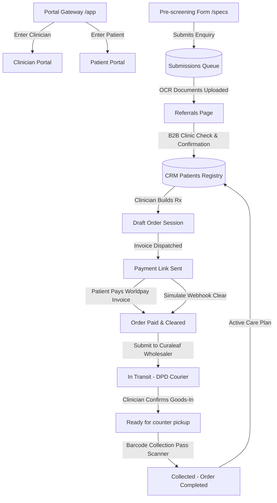

# Curaleaf Prescription Platform - Full Technical Breakdown

This document provides a comprehensive technical breakdown of all files created, modified, and integrated during the development of the Curaleaf B2B2C prescription management platform.

---

## 🏛️ System Architecture & Data Flow

The platform operates as a unified Single-Page Application (SPA) driven by a centralized React Context (`AppContext.tsx`). State changes inside either the Clinician Portal or the Patient Portal instantly propagate throughout the entire system via shared reducer actions.

---

## 📂 File-by-File Breakdown

### 1. Centralized State Management & Schemas
#### 📄 `src/context/AppContext.tsx` (Modified)
* **Purpose**: Serves as the central database and action reducer for the entire platform.
* **Key Schemas Defined**:
  * `CRMPatient`: Represents a registered patient. Tracks their contact info, address, status, and `interactions` timeline logs (`{ ts, type, detail }`).
  * `EligibilitySubmission`: Represents a candidate intake form entry. Tracks DOB, medical condition, exclusion filters, and `calls` activity.
  * `Prescription` & `PatientOrder`: Represents prescription products (`LineItem`), cost vs. retail pricing, Worldpay billing references, courier tracking numbers, and fulfillment stages (`draft | awaiting-approval | approved | dispatched | ready | collected`).
* **Key Actions Handled**:
  * `SET_PORTAL_MODE`: Toggles the screen wrapper between gateway selector, clinician dashboard, and patient dashboard.
  * `SET_PATIENT_EMAIL` / `LOGOUT_PATIENT`: Handles patient authentication states.
  * `LOG_INTERACTION`: Appends audit logs to patient files (e.g. counter reminder SMS triggers, repeat requests, check-up appointments).
  * `CONFIRM_PAYMENT` / `PLACE_ORDER`: Simulates secure payment hooks and wholesaler submission.
  * `RECEIVE_SHIPMENT` / `HANDOVER_TO_PATIENT`: Drives goods-in counter check-ins.

---

### 2. Portal Gateway & Router Wrapper
#### 📄 `src/App.tsx` (Modified)
* **Purpose**: Configures the root component layout, portal gateways, and application notifications.
* **Key Features**:
  * **Portal Gateway Selector**: Renders high-end cards detailing the separate purposes of the clinician console vs. patient wellness space.
  * **Toast Notification Manager**: Renders overlay alert toasts (`success | info | warning | error`) driven by dispatch actions.
  * **Root Router**: Renders the respective sub-screens (`Dashboard | Referrals | CreateOrder | AwaitingPayment | Orders | Patients | PatientPortal`) depending on the session variables.

---

### 3. Patient Portal
#### 📄 `src/pages/PatientPortal.tsx` (Created)
* **Purpose**: A patient wellness space allowing prescription tracking, bill secure payment, and check-up scheduling.
* **Key Features**:
  * **Demo Selector (One-Click Logins)**: Pre-fills and authenticates test emails instantly (e.g. Mohammed Khan or Aisha Smith).
  * **Secure Worldpay Invoicing Widget**: Breaks down prescribed costs and mounts a checkout button simulating Worldpay card payments.
  * **Boarding Pass Collection Barcode**: Generates a counter-ready collection boarding pass (`HH-[Order]-[Rx]`) when the status is updated to `ready`.
  * **Repeat Reorder Schedule**: Dynamically tracks last order dates and calculates 30-day clinical reorder eligibility (toggling warnings if overdue).
  * **Prescription History Ledger**: Archives completed orders, providing itemized product titles and cost receipts.
  * **Pharmacy Care Desk**: Submits reorder repeats and appointment call notifications directly to the clinician dashboard.

---

### 4. Clinician Portal Screens
#### 📄 `src/pages/Dashboard.tsx` (Modified)
* **Purpose**: The operations console for pharmacy counter staff.
* **Key Features**:
  * **Urgent Action Items Widget**: Evaluates state collections and dynamically lists urgent follow-up panels:
    * *Eligibility Intake Bottlenecks* (Referral forms pending review $>48$ hours).
    * *Uncollected Medication Warnings* (Ready medicines sitting counter-ready $\ge 10$ days).
    * *Overdue Payments* (Active Worldpay link outstanding $>3$ days).
    * *Overdue Repeat Callbacks* (CRM patients with no orders in the last 30 days).
    * *Patient Portal Requests* (Displays live repeat reorders or check-up callbacks requested by patients via their portal).
  * **Interactive Workflows**: Action buttons trigger callbacks, resend payment links, launch prescription builders, and clear warnings dynamically.

#### 📄 `src/pages/Patients.tsx` (Modified)
* **Purpose**: The unified directory for pre-screening enquiries and registered CRM patients.
* **Key Features**:
  * **Clickable Stats Switcher Grid**: Displays total metrics (`All Patients | Enquiries | Active Treatments | On Order`) and acts as a tab switcher.
  * **Detail Slide-over Drawer**: Details patient profiles, active treatment orders, and displays a scrollable **Audit & Interaction Log Timeline** that records all clinician actions, counter check-ins, and portal requests.
  * **Uncollected Badges**: Flags overdue patients with warning banners.

#### 📄 `src/pages/Referrals.tsx` (Modified)
* **Purpose**: The pre-screening clinical eligibility intake review board.
* **Key Features**:
  * **Clickable Stage Stats Grid**: Switches tabs between `All Intake | Enquiries | Clinical Files | Referred | CRM Confirmed`.
  * **OCR Document Scanner Simulator**: Interactive loading bar simulating records scanning, verifying conditions, and logging audit approvals.

#### 📄 `src/pages/Orders.tsx` (Modified)
* **Purpose**: Oversees B2B wholesaler transit and counter collection check-ins.
* **Key Features**:
  * **Fulfillment Stage Grid**: Switcher grid tracking `All Orders | Awaiting Approval | Approved | In Transit | Ready | Collected`.
  * **Confirm Arrived (Goods-In)**: Registers incoming wholesaler packages, assigns local counter locations, and triggers counter barcode collection codes to patients.

#### 📄 `src/pages/AwaitingPayment.tsx` (Modified)
* **Purpose**: Displays active Worldpay invoice links and tracks cleared collections.
* **Key Features**:
  * **Worldpay Webhook Simulator**: Buttons triggering immediate Worldpay webhook clearing notifications to simulate customer checkout callbacks.
  * **Switcher Grid**: Clicking `All Payments | Awaiting Payment | Paid` filters payments.

#### 📄 `src/pages/CreateOrder.tsx` (Modified)
* **Purpose**: The practitioner prescription builder interface.
* **Key Features**:
  * **Product Catalog**: Lists flower/capsule stocks, retail prices, and computes dealer margin percentages dynamically.

---

### 5. Layout & Design System
#### 📄 `src/index.css` (Modified)
* **Purpose**: Configures the design system tokens, typography scales, and visual layouts.
* **Key Upgrades**:
  * **Readability Overhaul**: Scaled root typographic sizing tokens up (XS to 13px, SM to 14px, Base Body to 15px, and Table text to 15px) for easier scanning.
  * **Enhanced Contrast Rules**: Upgraded primary text to white (`#FFFFFF`) and secondary copy to slate-200 (`#E2E8F0`), creating a high-contrast **10:1 ratio** on card backgrounds to satisfy accessibility needs.
  * **Card Divider Borders**: Set border definitions to slate-700 (`#334155`) for crisp card grids.

#### 📄 `src/components/Navigation.tsx` (Modified)
* **Purpose**: Sidebar navigation displaying active screen labels and page transition tabs.

---

### 6. Static Static Forms & Gateway Mock Files
#### 📄 `specs/HHH-Portal-Gateway.html` (Created)
* **Purpose**: Static gateway mock demonstrating white-labeled landing page entry points.
#### 📄 `specs/HHH-Patient-Portal.html` (Created)
* **Purpose**: Static preview page mapping patient login routes.
#### 📄 `specs/HHH-Eligibility-Form.html` (Modified)
* **Purpose**: Integrates eligibility check hooks.
